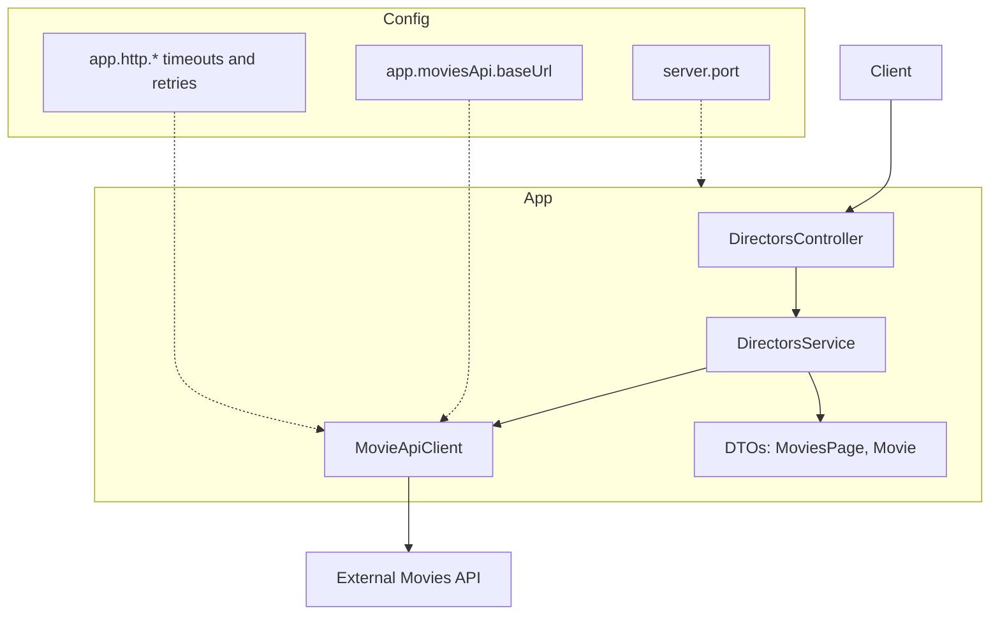

# Eron Back-End Developer Challenge

**Goal:** Expose `GET /api/directors?threshold=X` that:
1) fetches all pages from the external Movies API,
2) counts movies per director,
3) keeps directors with count **strictly greater** than `X`,
4) returns names **alphabetically**:
```json
{ "directors": ["Martin Scorsese","Woody Allen"] }
```

## Tech Stack
- Java 17, Spring Boot 3.x (Spring MVC)
- `RestClient` (blocking HTTP client, Spring 6)
- Gradle

## How to Run
```bash
# from project root
./gradlew clean build
./gradlew bootRun
```

Health check:
```bash
curl http://localhost:8080/actuator/health
```

Query the endpoint:
```bash
curl "http://localhost:8080/api/directors?threshold=4"
```

## Configuration
Edit `src/main/resources/application.yaml`:
```yaml
server:
  port: 8080
app:
  moviesApi:
    baseUrl: "https://wiremock.dev.eroninternational.com/api/movies/search"
  http:
    connectTimeoutMs: 3000
    readTimeoutMs: 5000
    maxRetries: 0
```

## Architecture


## Design Notes
- **No over-engineering:** MVC + blocking client fit the use case; avoids `.block()` on reactive loops.
- **DTOs as records:** concise, immutable mapping.
- **Business rules:** strictly `> threshold`, alphabetical order (case-insensitive).

## Assumptions & Edge Cases

- The external API is authoritative for pagination (total_pages) and may return empty data on some pages.

- On upstream connectivity/timeouts, the service returns 502 Bad Gateway with a compact JSON error.

- Directors with null/empty names are ignored for counting.

- Sorting is case-insensitive; ties are naturally handled.

## Implemented Improvements

- **Readable error handling:** @ControllerAdvice maps upstream failures to 502 and unexpected errors to 500.

- **Unit tests:**

    - DirectorsServiceTest: verifies counting, strict threshold, and alphabetical ordering with a fake API client.

    - MovieApiClientTest: verifies payload parsing via MockWebServer.

- **Simple demo page:** static HTML at `/` to invoke `/api/directors?threshold=X` and view the JSON response.
